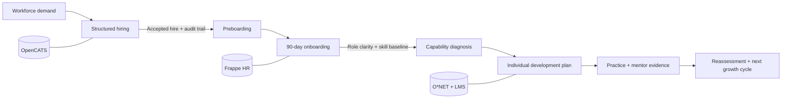

# Master People Operations & HRIS Portfolio

## Executive Portfolio Index

This portfolio presents three connected HR technology labs across the employee lifecycle: structured hiring, evidence-based onboarding, and skills-led talent development. Each lab combines a working interactive artifact with synthetic data, documented methods, governance controls, an executive slide deck, and automated reconciliation tests.

**Portfolio owner:** Mohammad Azimuddin  
**Profile:** MHRM, Aligarh Muslim University · Oracle Fusion Cloud Applications HCM Process Essentials Certified – Rel 1 (`1Z0-1162-1`)  
**Role alignment:** HR Operations Specialist · People Operations Associate · Junior HRIS Analyst · Talent Acquisition Operations · L&D Coordinator  
**Markets:** India and UAE relocation

Open the [master interactive portfolio](index.html) or use the [ATS-ready project bullets](MASTER_CV_PROJECTS_SNIPPET.md).

## Featured Portfolio Suite

### 1. Structured Hiring & ATS Architecture Lab

**Domain:** Talent Acquisition Operations & Psychometrics  
**Architecture:** OpenCATS-modeled workflow, structured selection, feedback SLA, fairness monitoring, and audit controls.

- [Open interactive lab](04_Structured_Hiring_and_ATS_Lab/index.html)
- [Open executive deck](04_Structured_Hiring_and_ATS_Lab/slides.html)
- 4,000 synthetic candidates across 5 requisitions
- 40/40/20 work-sample, structured-interview, and job-knowledge composite
- 120 hires · 3.0% conversion · 28.5d mean time-to-fill
- 91.8% 48-hour feedback SLA · 0.87 adverse-impact ratio

### 2. Evidence-Based 90-Day Onboarding & HR Operations Lab

**Domain:** Employee Onboarding, HRIS Workflow & Socialization  
**Architecture:** Frappe HR data model, six-phase T−14-to-Day-90 journey, 25-activity RACI, RBAC/privacy controls, and 14 UAT cases.

- [Open interactive lab](project%201/03_Evidence_Based_Onboarding_HR_Operations_Lab/index.html)
- [Open executive deck](project%201/03_Evidence_Based_Onboarding_HR_Operations_Lab/slides.html)
- 20-person synthetic active cohort with 60 onboarding tasks
- 93.4% Day-1 readiness · 88.5% task SLA adherence
- 24.2 days to role clarity · 3 open escalations
- Bauer-informed role clarity, task mastery, social integration, and organizational understanding

These are the live lab's source-reconciled measures. The model does not contain retention or aggregate experience-rating fields, so the master hub does not infer them.

### 3. Skills-Based L&D Planner & Talent Growth Engine

**Domain:** Talent Development, Competency Modeling & Training ROI  
**Architecture:** O*NET 31.0-linked ontology, transparent nine-box logic, 30/60/90-day IDPs, LMS hand-off, and Kirkpatrick L1–L4 evidence.

- [Open interactive lab](05_Skills_Based_LD_Planner/index.html)
- [Open executive deck](05_Skills_Based_LD_Planner/slides.html)
- 70 synthetic workforce profiles · 20 competencies · 70 IDPs
- 81.4% mastery · 58 active IDPs · 14 Star Talent profiles
- +24.6% yield · -18.2% scrap · ₹4.8 lakhs quarterly savings
- Level 4 figures are governed cohort associations and remain non-causal

## Employee Lifecycle Architecture



### Cross-lab control map

| Lifecycle decision | System model | Governed evidence | Primary hand-off |
|---|---|---|---|
| Who should enter the organization? | OpenCATS ATS | 40/40/20 composite, BARS, SLA, fairness ratio | Accepted hire and disposition trail |
| How should a joiner become effective? | Frappe HR | Readiness, task SLA, role clarity, escalation | Supported contributor and skill baseline |
| Which capability should grow next? | O*NET 31.0 + LMS workflow | Skill gap, IDP milestones, L1–L4 evidence | Reassessment and next development cycle |

## KPI Summary

| Lab | Scale | Governed results | Interpretation boundary |
|---|---|---|---|
| Structured Hiring | 4,000 candidates · 5 requisitions · 120 hires | 3.0% conversion · 28.5d time-to-fill · 91.8% SLA · 0.87 AIR | Synthetic selection demonstration; no production hiring claim |
| 90-Day Onboarding | 20 joiners · 60 tasks · 25 RACI activities | 93.4% readiness · 88.5% task SLA · 24.2 days role clarity · 3 escalations | Descriptive simulation; no retention-impact claim |
| Skills-Based L&D | 70 profiles · 20 competencies · 70 IDPs | 81.4% mastery · 58 active IDPs · 14 Star Talent · +24.6% yield | Operational results are synthetic and non-causal |

## Architecture and Repository Map

```text
06_Portfolio_Projects/
├── index.html                         Master interactive portal
├── README.md                          Executive portfolio index
├── MASTER_CV_PROJECTS_SNIPPET.md      India/UAE ATS-ready bullets
├── 04_Structured_Hiring_and_ATS_Lab/  Talent acquisition system
├── project 1/03_Evidence_Based.../    Onboarding and HR operations system
└── 05_Skills_Based_LD_Planner/        Talent development system
```

Each featured project contains its own README, methodology, data dictionary, governance artifacts, interactive HTML, slide deck, source CSVs, and project-specific acceptance test.

## Reproduction

From the repository root:

```bash
python3 "98_Maintenance/tests/test_master_portfolio_hub.py"
python3 "98_Maintenance/tests/test_structured_hiring_ats_lab.py"
python3 "98_Maintenance/tests/test_onboarding_hr_operations_lab.py"
python3 "98_Maintenance/tests/test_skills_based_ld_planner.py"
```

Open `06_Portfolio_Projects/index.html` in a modern browser. Tailwind CSS and Lucide icons load from public content-delivery networks; project data and navigation remain local and relative.

## Credential and Evidence Boundaries

- The Oracle Fusion Cloud HCM credential and education details follow the repository's verified profile record.
- The 70-headcount myTVS operating context is candidate-reported and should not be described as independently verified employment evidence until supporting documentation is available.
- The GitHub profile link is derived from the published onboarding-project repository identity.
- No phone number, government identifier, raw employee record, or machine-specific path is published in the hub.
- Every lab dataset is synthetic. Descriptive associations are not automatically causal, predictive, or production validated.

## Additional Projects

### UAE Workforce Planning and Total Rewards Command Centre

Open [`02_UAE_Workforce_Planning_and_Total_Rewards/dashboard.html`](02_UAE_Workforce_Planning_and_Total_Rewards/dashboard.html). This scenario includes 650 fictional employee records, 24 hypothetical salary bands, 24 months of movement/payroll/budget data, and three workforce-planning scenarios. It is not UAE market-benchmark data.

### Synthetic HR Analytics Dashboard

Open [`01_Synthetic_HR_Analytics_Dashboard/dashboard.html`](01_Synthetic_HR_Analytics_Dashboard/dashboard.html). This descriptive lab contains 120 privacy-safe fictional employee records, an Excel/Power BI-compatible CSV, an interactive dashboard, methodology, measures, and interview-preparation materials.

Do not present any portfolio result as production experience until you can reproduce its calculation, explain its data boundary, and defend the operating decision it supports.
