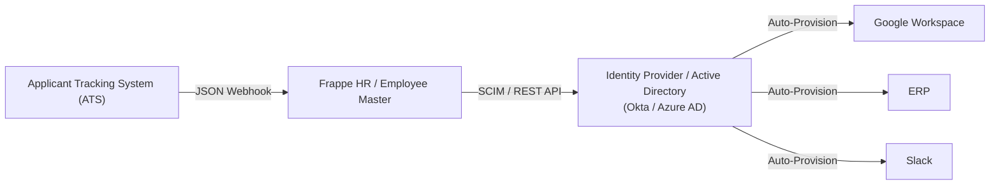

# Organization and Roles

## 1. Fictional company profile

**Apex Precision Dynamics Ltd. (APD)** is a fictional Indian business-to-business manufacturer of precision motion-control assemblies. It operates one manufacturing and engineering site plus a small corporate office. The organization has **70 active employees** in the simulated design baseline. All names, codes, structures, and numbers are invented.

APD’s operating priorities are product quality, safe delivery, ethical conduct, customer reliability, and continuous improvement. The onboarding model must therefore coordinate HR, line management, IT, quality/safety owners, payroll/finance, and a peer buddy without exposing unnecessary personal data.

## 2. Department structure

| Formal department | Headcount | CSV code | Core responsibility |
|---|---:|---|---|
| Engineering & Operations | 26 | Engineering | Product/process engineering, production, automation, maintenance, and operational excellence |
| Quality Assurance | 12 | Quality | Quality systems, inspection, supplier quality, audit readiness, and corrective action |
| Supply Chain | 11 | Supply Chain | Procurement, planning, inventory, logistics, and supplier coordination |
| Finance | 9 | Finance | Accounting, planning, controls, payroll coordination, and commercial support |
| People & Culture | 12 | People & Culture | HR operations, recruitment, learning, employee experience, HRIS, and workplace administration |
| **Total** | **70** | — | — |

The shorter CSV codes support compact analytics. The formal name remains the display name in policy and governance documentation.

## 3. Five-band grade architecture

| Grade | Career scope | Typical accountabilities | Approval boundary | Example cohort roles |
|---|---|---|---|---|
| APD-G1 | Entry / foundational | Learns defined processes; delivers supervised tasks | No people or financial approval | Graduate Manufacturing Engineer, People Operations Associate |
| APD-G2 | Professional / skilled | Owns recurring work; resolves routine exceptions | Recommends, does not approve controlled changes | Quality Systems Analyst, Procurement Coordinator |
| APD-G3 | Senior professional | Leads complex work and cross-functional coordination | May approve operational work within delegated limits | Process Improvement Engineer, HRIS Analyst |
| APD-G4 | Lead / manager | Leads a team or specialist domain; manages risk and capability | Manager approvals within function | Supplier Quality Lead, Commercial Finance Partner |
| APD-G5 | Head / director | Sets functional direction and controls major risk | Executive or policy-level approvals | Quality Director, Operations Excellence Manager |

Grades select a starting template and approval route; they do not determine an individual’s adjustment outcome. Job-specific requirements must be added by the manager and reviewed by HR Operations.

## 4. Lifecycle roles and responsibility boundaries

| Role code | Role | Primary responsibility | Must not do alone |
|---|---|---|---|
| HR | HR Operations | Create the employee record, launch the template, validate mandatory evidence, monitor SLAs, and coordinate escalation | Approve its own privileged access or make technical-access decisions |
| HM | Hiring Manager | Define role outcomes, assign work, coach, review role clarity/task mastery, and decide closure or supported extension with HR | View restricted identity/financial data without a documented purpose |
| IT | IT Administrator | Provision and revoke approved accounts, devices, and role-based groups; retain technical audit evidence | Change employment status, scores, or leave policy |
| BY | Buddy | Support navigation, introductions, practical questions, and psychological safety | Evaluate performance, approve employment decisions, or view private HR notes |
| EE | Employee / Newcomer | Provide required information, complete assigned learning/tasks, seek clarification, and acknowledge agreed objectives | Approve own records, access other employees, or alter control evidence |
| FN | Finance / Payroll | Validate payroll-critical fields and full-and-final financial components | View adjustment pulse scores or buddy notes |
| SO | Safety / Quality Owner | Deliver and attest regulated site, safety, and quality learning | Access identity or compensation data unrelated to certification |
| HRIS | HRIS Administrator | Configure controlled values, workflows, roles, reports, and audit support | Self-approve production changes or consume records for unrelated analysis |

## 5. Frappe HR–modeled object map

| APD object | Frappe HR concept | Key fields / links | Control owner |
|---|---|---|---|
| Company | Company | APD legal/display name, default holiday list | HRIS with Finance approval |
| Employee master | Employee | Employee ID, status, joining date, company, department, designation, grade, reports-to | HR Operations |
| Department hierarchy | Department | Formal name, parent company, abbreviated analytics code | HRIS |
| Job catalogue | Designation | Controlled role title linked to approved job profile | People & Culture lead |
| Grade catalogue | Employee Grade | APD-G1 to APD-G5 | People & Culture lead |
| Onboarding blueprint | Employee Onboarding Template | Department/designation/grade applicability, activity, role, user, start offset, duration | HR Operations process owner |
| Onboarding instance | Employee Onboarding | Employee, template, date, project/tasks, workflow status | HR Operations and Hiring Manager |
| Work evidence | Task / assignment reference | Owner, due time, status, completion/evidence reference, escalation | Assigned activity owner |
| Leave entitlement | Leave Policy Assignment / Leave Allocation | Employee, policy, effective dates, generated allocation | HR Operations with policy approval |
| Separation blueprint | Employee Separation Template | Asset, access, knowledge, payroll, and document activities | HR Operations process owner |
| Financial closure | Full and Final Statement concept | Payables, receivables, assets, approval state | Finance / Payroll |

This mapping is conceptual and version-aware configuration would be required before implementation. The CSV extracts deliberately use business-friendly field names rather than asserting an exact underlying DocType schema.

## 6. Enterprise HR technology integration

| Interface | Minimum payload | Control point | Failure route |
|---|---|---|---|
| ATS → Frappe HR / Employee Master | Approved requisition, candidate reference, position, manager, location, start date; no interview narrative | Signed JSON Webhook, schema validation, idempotency key, quarantine on mismatch | HRIS exception queue; HR confirms source record before replay |
| Frappe HR → Identity Provider / Active Directory | Employee ID, employment state, start/end event, approved group profile | SCIM / REST API service identity, least-privilege scope, retry log, maker-checker approval for elevated groups | IT incident queue and Day-1 readiness exception |
| IdP/AD → Google Workspace / ERP / Slack | Immutable worker reference, approved role groups, activation time | Auto-Provision only after application/data-owner approval; MFA and audit event required | Revoke partial provisioning, retain error reference, and follow tiered SLA escalation |

The diagram is a target-state control model, not evidence of a production integration. Secrets, identity documents, compensation, survey responses, and case notes are excluded from the integration payloads.

## 7. Role-specific onboarding segmentation

The source brief uses the cohort labels **Plant/Technician Roles (G5)** and **Desk/Engineering Roles (G1–G4)**. To preserve the established data contract, these are treated as intake shorthand only: `G5` in that phrase is a workflow grouping label, **not the APD-G5 employee grade**. The controlled APD grade master remains APD-G1 entry through APD-G5 head/director, and HRIS routing uses job family, work location, hazard profile, and access profile rather than grade alone.

| Source brief label | Controlled onboarding profile | Emphasis and Day-1 gate |
|---|---|---|
| Plant/Technician Roles (G5) | `APD-ONB-PLANT-TECH` | EHS induction and attestation; physical badge zoning; PPE; supervised machine clearance; lockout/tagout and emergency routes; no equipment operation before authorization |
| Desk/Engineering Roles (G1–G4) | `APD-ONB-DESK-ENG` | Approved cloud repositories; IDE access; source-control and secrets handling; VPN/MFA; device posture; remote-work compliance and secure collaboration |

Hybrid and supervisory roles can receive both profiles. The strictest unresolved safety, identity, or privileged-access gate controls activation, while noncritical tasks use a safe interim work plan.

## 8. Joiner process flow

1. **Approved hire received:** Recruitment sends the approved offer outcome, position, manager, location, grade, and joining date to HR Operations.
2. **Employee master prepared:** HR creates the minimum required employee record in Draft and validates controlled values.
3. **Template selected:** Department, designation, grade, location, and worker type determine the baseline onboarding template.
4. **Activities instantiated:** The onboarding record creates owned tasks with phase offsets and SLA expectations.
5. **Access approved and provisioned:** The manager requests business access; application/data owners approve; IT provisions only approved groups.
6. **Day-1 gate checked:** HR confirms essential documentation, schedule, workspace/device, identity-safe access, and named support.
7. **30/60/90 reviews recorded:** Manager, newcomer, buddy, and HR provide only the evidence relevant to their role.
8. **Close or extend:** Manager and HR close the workflow when mandatory gates are met or document a time-bound support extension with reason, owner, and next review date.
9. **Audit extract retained:** Operational metadata and evidence references are retained under the approved schedule; transient copies are removed.

## 9. Mover process flow

Internal moves reuse the control structure without repeating irrelevant joiner actions:

1. Approve the new position, effective date, grade/designation change, reporting line, and business access.
2. Update the Employee master through a controlled transaction with maker-checker review.
3. Launch a role-transition template covering role clarity, access changes, task mastery, stakeholder introductions, and any regulated learning.
4. Remove incompatible old-role access before or at activation of new-role access.
5. Run 30- and 60-day transition reviews; use a 90-day gate only for materially different roles.
6. Close after access reconciliation and manager confirmation.

## 10. Leaver / offboarding process flow

1. HR records an approved separation case and confirmed last working date.
2. The Employee Separation Template creates activities for knowledge transfer, asset recovery, access revocation, leave/payroll review, and required communication.
3. The manager owns knowledge and work handover; IT owns account/device controls; Finance owns financial closure; HR owns lifecycle coordination.
4. High-risk access is revoked at the approved event time. Shared secrets and delegated approvals are rotated or reassigned.
5. Assets and outstanding items are reconciled; exceptions receive an owner and deadline.
6. Full-and-final components move through Finance approval; HR cannot approve Finance-controlled values.
7. The Employee status changes to Left only after mandatory approvals and the relieving date are present.
8. Operational records enter the retention schedule; access to former-worker data remains purpose-limited and logged.

## 11. Naming and master-data rules

- Employee IDs follow `APD-YYYY-NNN`; they are never reused.
- Department, designation, grade, status, and owner role are controlled values.
- Manager and buddy IDs reference the synthetic APD role directory; they do not reveal personal email or phone data.
- Templates follow `APD-ONB-{DEPT}-{GRADE}-v{major.minor}` and separation templates follow `APD-SEP-{WORKER-TYPE}-v{major.minor}`.
- Inactive designations and grades remain available for historical reporting but cannot be selected for new transactions.
- Master-data changes require a request, impact assessment, approver, effective date, test evidence, and audit log.

## 12. Operating cadence

| Cadence | Forum | Decisions |
|---|---|---|
| Daily during active starts | HR Operations control huddle | Day-1 risks, overdue critical tasks, access/document blockers |
| Weekly | Hiring Manager and HR review | Role/task support, upcoming gates, unresolved handoffs |
| Monthly | HRIS control review | SLA trends, permission changes, defects, data-quality exceptions |
| Quarterly | People governance review | Template effectiveness, fairness checks, retention/deletion actions, policy changes |

Escalation follows severity and business impact. Safety, unlawful access, payroll-blocking, and identity-risk issues receive immediate routing; developmental support issues receive a named owner and agreed review date.
